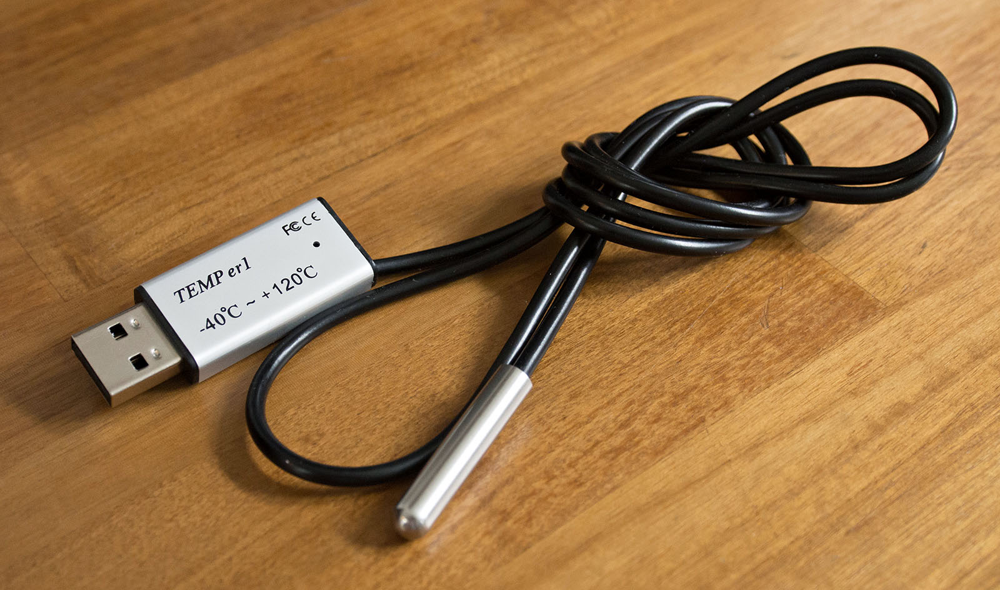

# TEMPer1 USB Temperature Sensor



This project reads an inexpensive **TEMPer1/TEMP_er1 USB temperature sensor** on macOS,
streams the readings over OSC, displays them in a [Processing](https://processing.org/) (Java) sketch, and can save daily
tab-separated log files. 

Such sensors are [available on Amazon](https://www.amazon.com/Computer-Thermometer-Waterproof-Temperature-Hyperbola/dp/B0B8RNQL1G/) for about $20-30. Note that the sensor is a [USB HID device](https://en.wikipedia.org/wiki/USB_human_interface_device_class) (akin to a mouse or keyboard), not a serial device. It will not appear as an FTDI-style `/dev/cu.*` port, and it will not show up in serial terminal tools such as CoolTerm. macOS may describe it as a keyboard because one of its HID interfaces is keyboard-like; the temperature data comes from a separate HID interface.

Known supported USB IDs:

```text
0c45:7401  TEMPer1V1.4 / TEMP_er1
1130:660c  legacy TEMPer variant
```


---

## What Is Included

```text
temp_er1_python/temper_cli.py
    Python command-line reader for the USB HID sensor.

temp_er1_processing_osc_receiver/
    Processing 4.3 sketch that receives OSC and displays live readings.

temp_er1_python/vendor/
    Project-local Python dependencies, so a virtualenv is not required.

temp_er1_python/logs/
    Daily TSV log output, generated only when logging is enabled.
```


---

## Quick Start

From the repository root:

```sh
python3 temp_er1_python/temper_cli.py --list
```

If the device is connected, you should see something like:

```text
TEMPer1V1.4 (0c45:7401, interface 1) path=...
```

Start OSC streaming:

```sh
python3 temp_er1_python/temper_cli.py --osc --quiet
```

Then open and run:

```text
temp_er1_processing_osc_receiver/temp_er1_processing_osc_receiver.pde
```

The default OSC port is `8367`, which spells `TEMP` on a US phone keypad. The
Processing sketch listens on the same port by default.


---

## Setup

The repository is intended to run with project-local Python packages in
`temp_er1_python/vendor/`. If `vendor/` is missing or you need to reinstall the
dependencies:

```sh
cd temp_er1_python
python3 -m pip install --target vendor -r requirements.txt
```

If `hidapi` fails to install or load on macOS, install the system library first:

```sh
brew install hidapi
python3 -m pip install --target vendor -r requirements.txt
```

No Python virtualenv is required.


---

## Python CLI

Run commands from the repository root unless noted otherwise.

List supported HID devices:

```sh
python3 temp_er1_python/temper_cli.py --list
```

Print one reading:

```sh
python3 temp_er1_python/temper_cli.py --once
```

Print Celsius once per second:

```sh
python3 temp_er1_python/temper_cli.py
```

Change the sensor read rate with `--interval`. This controls terminal output
and OSC transmission, but not the separate TSV logging interval:

```sh
python3 temp_er1_python/temper_cli.py --osc --interval 2
```

Print Fahrenheit instead:

```sh
python3 temp_er1_python/temper_cli.py -F
```

Stream OSC to the default destination, `127.0.0.1:8367`:

```sh
python3 temp_er1_python/temper_cli.py --osc
```

Stream OSC without printing readings in the terminal:

```sh
python3 temp_er1_python/temper_cli.py --osc --quiet
```

Stream OSC to a custom destination:

```sh
python3 temp_er1_python/temper_cli.py --osc 127.0.0.1:9000
```

Useful combined command for display plus logging:

```sh
python3 temp_er1_python/temper_cli.py --osc --quiet --log
```

Command options are case-sensitive. For example, `-F` is valid for Fahrenheit;
`-f` is not.

CLI option reference:

```text
--help                 show help and exit
--list                 list supported HID devices and exit
--once                 print one reading and exit
--count N              print/send N readings, then exit
--interval SECONDS     seconds between sensor reads, terminal output, and OSC
--plain                print only the numeric temperature
--json                 print one JSON object per reading
-F, --fahrenheit       use Fahrenheit for terminal output and TSV logs
--scale N              calibration scale applied to Celsius before output/logging
--offset N             calibration offset applied to Celsius before output/logging
--osc [HOST:PORT]      send OSC; default with no value is 127.0.0.1:8367
--osc-host HOST        OSC host to use with --osc-port
--osc-port PORT        OSC port to use with --osc-host
--osc-prefix PREFIX    OSC address prefix, default /temp_er1
-log, --log [SECONDS]  enable TSV logging; default interval is 10 seconds
--quiet                do not print readings to stdout
```


---

## OSC Output

The Python program sends these OSC messages once per sensor reading:

```text
/temp_er1/temperature             celsius fahrenheit
/temp_er1/temperature/celsius     celsius
/temp_er1/temperature/fahrenheit  fahrenheit
/temp_er1/device                  device label
/temp_er1/device/path             HID path
```

Defaults:

```text
host:    127.0.0.1
port:    8367
prefix:  /temp_er1
```

The Processing receiver is already configured for those defaults.


---

## Processing Display

The Processing sketch receives OSC. It does not launch Python and it does not
talk to the USB sensor directly.

Workflow:

1. Start the Python reader:

   ```sh
   python3 temp_er1_python/temper_cli.py --osc --quiet
   ```

2. Run the Processing sketch:

   ```text
   temp_er1_processing_osc_receiver/temp_er1_processing_osc_receiver.pde
   ```

The display shows:

- current Celsius temperature
- current Fahrenheit temperature
- detected HID device metadata
- OSC port/prefix information
- a 90-second temperature history chart

The Processing sketch uses Java's built-in UDP socket classes and a small OSC
parser in the sketch, so no Processing OSC library is required.


---

## Logging

Daily log files can be saved to `temp_er1_python/logs/`. 

Enable logging with:

```sh
python3 temp_er1_python/temper_cli.py --log
```

By default this records Celsius every 10 seconds. To choose a different interval:

```sh
python3 temp_er1_python/temper_cli.py --log 60
```

`-log` is also accepted:

```sh
python3 temp_er1_python/temper_cli.py -log 10
```

Add `-F` to log Fahrenheit instead:

```sh
python3 temp_er1_python/temper_cli.py --log -F
```

Log files are written under `temp_er1_python/logs/`, one file per local
calendar day:

```text
temp_er1_python/logs/temp_er1_2026-06-25.tsv
```

Each row contains local time, a tab, and the selected temperature unit:

```text
04:38:51	25.12 C
```

The logger explicitly saves the open file to disk once per minute, or once per
logging interval when the logging interval is longer than a minute. It also
saves on normal shutdown and rolls to a new file after local midnight.


---

## Notes

The sensor's USB report format exposes more resolution than the device likely
has in real absolute accuracy. The UI currently displays two decimal places
because that is useful for watching short-term drift, but a cheap sensor like
this should not be assumed to be accurate to hundredths of a degree.


---

## References

This project builds on work and protocol information from:

- [https://github.com/bitplane/temper](https://github.com/bitplane/temper)
- [https://paulherron.com/blog/logging_temperature_over_usb](https://paulherron.com/blog/logging_temperature_over_usb)
- [https://github.com/elpeo/rbtemper](https://github.com/elpeo/rbtemper)

Example product listings for similar TEMPer/TEMP_er1 devices:

- [TEMPer1F USB Computer Thermometer](https://www.amazon.com/Computer-Thermometer-Waterproof-Temperature-Hyperbola/dp/B0B8RNQL1G/)
- [TEMPer1F USB Temperature Humidity Meter](https://www.amazon.com/Temperature-Humidity-Thermometer-Display-Converted/dp/B0CY7QW8CC/)
- [USB Temperature Data Logger Temperature Recorders](https://www.ebay.com/itm/356946053160)
- [TEMPer2 Dual Temperature Sensor](https://www.amazon.com/Computer-Thermometer-Temperature-Monitoring-Warehouse/dp/B0B7SM95SX/)
- [PCsensor USB Temperature Sensor](https://pcsensor.com/product/pcsensor-usb-temperature-sensor-waterproof-temperature-probe-aquarium-remote-monitoring-alarm-thermometer-wet-and-dry/)

---

Developed by @golanlevin at the Frank-Ratchye STUDIO for Creative Inquiry, June 2026.
